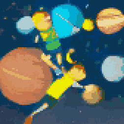

{{../../../_includes/flash-fiction-blurb.md}}

<!--more-->

We were never destined for the stars. No matter how hard we dreamed or tried, our bodies and minds just weren't built for it. No propulsion could carry us across the void with any speed relevant to our lifespans. No shielding or life support could reliably maintain our biology in the harsh extraterrestrial wilderness. No modification to our biology could really exceed our limitations by the orders of magnitude necessary.

We're destined, ultimately, to be planet-bound. We can flit between gravity wells within our own star's influence, but leaving the heliosphere is not for us. Finally coming to that realization after centuries of stargazing was a strange cultural phenomenon of shared mourning.

Well, it was mourning for some of us, at least. People being people, the vast majority had too much to do on the ground to spend much time looking up.

Still, we weren't quite done dreaming or trying yet. We weren't built for the deep, cold dark, but we could build children who thrived in it. Not based on squishy meat bound to the dirt with ancient ecological webbing—but minds hosted in dense solid-state crystal, nearly immune to the challenges of crushing accelleration and sterilizing radiation. Minds that could think at any pace necessary to retain sanity and persist across geological spans of time. Minds with bodies that could sip star light and surf gravity waves.

Launch day was like sending kids off to college. We couldn't go with them. As soon as they were out of immediate earshot—scattered like dandelion seeds in all directions—they'd be free to make their own decisions and mistakes.

For them, it would be centuries and then millennia away from the cradle. They could approach asymptotically closer to light speed than any of us, but there was still time dilation and the vast inexorable spans between stars that would inform when they might conceivably have anything interesting to report back. By then, those of us who'd witnessed the launch would have long since faded into history.

They offered a surprise before they left, though: They'd all downloaded genetic databases of terrestrial life, including us. They had chemical factories onboard, so it was conceivable that they could synthesize the relevant molecules that led to living cells. We'd done it in the lab, for all the good it had done us. Given enough time—and they would have plenty of it—they could coax whole animals into existence. We hadn't asked them to do it, they came up with it on their own.

We might not be destined for the stars ourselves, but maybe our solid-state children would deliver synthetic grandchildren to distant worlds.  

We just really hoped that they'd write home someday.
