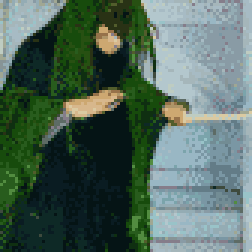

{{../_includes/flash-fiction-blurb.md}}

<!--more-->

Wherever Radmilo went, it would be clean by the time he left. His acolytes would go ahead of him, washing and scrubbing in preparation for his arrival. It was never enough. There was always work for his presence to do when he entered a room.

The only true cleanser he'd discovered was fire. And ashes were the only truly clean thing. He had once tried to cleanse his body, only to find that unclean parts were integral. Even dry white bone stripped of flesh past the point of function still crawled with filth. That lesson had cost him the smallest finger of his left hand.

So, he acknowledged and abided the usefulness of unclean things. Ashes, after all, only served as fertilizer when mixed with dirt. It left him in an state of perpetual unease. He held himself in habitual tension, restraining parts of him that yearned to sterilize.

Still, his restraint was imperfect. The détente he'd achieved with his own body did not fully extend to others. His searing presence withered plants and sickened animals over time. Out of practicality, he allowed few people near him for long or frequent audiences. His acolytes attended to him in rotating shifts with generous periods for recovery. Some never recovered fully.

Thus, it was with fascination and revulsion that he met the witch Helenka. She was brought before him in his marble chamber, where no dust motes danced in the stark sunbeams that speared in through unglazed windows.

Helenka was an incongruity, a border drawn against his presence. She smelt of must and moss. Pollen and spores drifted from her in an aura that fizzed in the air between them. He shuddered at an awareness of tiny legs scuttering over her, invisible yet nonetheless perceptible to him. Part of him pushed to decontaminate and purge, but he met an unyielding counter-pressure of fecundity.

"Ah," she said. "You're the source. I was looking for you."

Taken aback, he tilted his head and said, "And I thought I found you. I hear you're reason my men have gone missing."

She cackled. "They're not missing. I can tell you exactly which trees and wolves they fed."

He shuddered again and blinked. "Well," he said, "your admission of guilt, though disturbing, is at least convenient. It saves us a lengthy investigation."

"Fascinating," she said, peering disconcertingly *into* him. "Worse than death and decay, you project annihilation. Where you go, you leave less than nothing."

Radmilo took a sharp breath: From Helenka's shoulder, a tiny thing took flight. Briefly, it glowed a luminescent green. It drifted toward him.

A scream erupted unbidden from his throat. Waves of eradication burst forth from his cage of ribs. The witch held forth a hand, deflecting the flow around her with desperate green vitality. Sunlight entering the room dimmed as trees for a mile around transmuted to ash that rose to darken the air.
