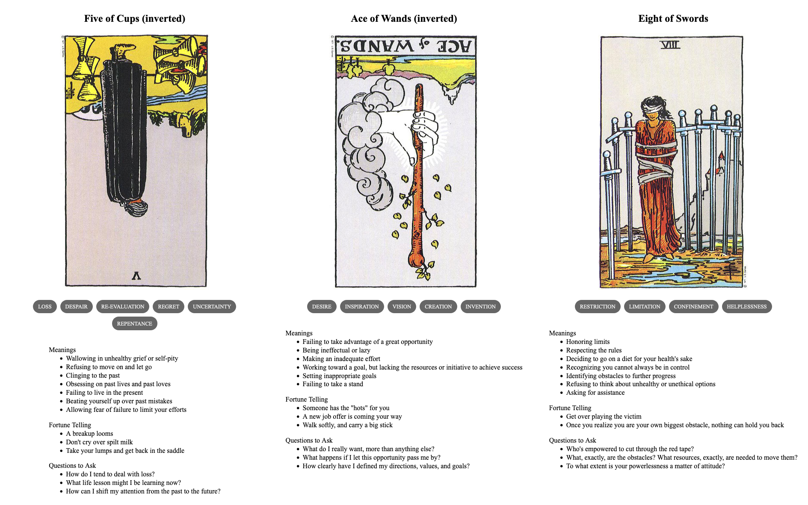

{{../../../_includes/flash-fiction-blurb.md}}

<!--more-->

Sorina thought it was a brilliant idea. Those Magic Eye posters were selling out like mad at the mall. She knew just how to improve them: put them on a computer screen and *make them move*. Better yet, *make them interactive* as computer games.

It was also just the excuse she needed to upgrade her old 286 to a brand new 386SX with a CD-ROM and brand new sound card. She hit the mall on the way home from work and left with the new machine and a trunk full of posters.

She had enough download credits on a zone-call BBS to grab a pirated C++ IDE from the files section. While ZModem did it's thing, she spread all the posters out on every flat surface in her apartment. Weird nautical scenes, kaleidoscopic stained glass, psychedelic swirls, nonsensical cartoon collages—a visual cacophony she strained to force into meaning.

Once she got the knack, though, it was like she'd always seen hearts and eagles and planets and sailboats condensing out of the patterns of noise. Something had rewired her brain and thereafter she couldn't not see it. It was kind of creepy, really. But, she could understand why people were buying these things.

She needed to do more than just see the shapes, though. She needed to work out how to *make* them. Staring and staring, she experimented with her eyes until she understood it was about staring *through* the image until repeating segments of the pattern overlapped. Except, the segments didn't *perfectly* repeat: little parts here and there were subtly shifted with respect to each other.

She checked the file transfer: about 47% done, another hour to go at least. She hoped she'd remembered to turn off call waiting.

She started doodling in pencil: just some simple outlines, repeated side-by-side. She played with the separation and got a feel for its relationship to the simulation of depth. She didn't really have the math down, but she could stumble her way toward that once she started programming some graphics.

Her new PC beeped: the file transfer was done. Time to try unpacking and installing it, then she could get to work. 

## Prompt

A 3-card spread from my [Tarot Thing](https://lmorchard.github.io/tarot-thing/?card=%21Five+of+Cups&card=%21Ace+of+Wands&card=Eight+of+Swords):

